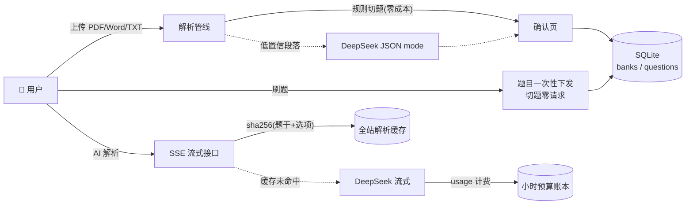

<div align="center">


# ⚡ 速刷 SuShua

**期末题库,上传即刷 —— 把老师发的题库文件,30 秒变成你的刷题神器**

[](https://sushua.versecraft.cn)
[](https://nextjs.org)
[](https://www.typescriptlang.org)
[](https://sqlite.org)
[](../../pulls)
[](#license)

无注册 · 无登录 · 手机友好 · AI 讲解 · 全站免费

[在线体验](https://sushua.versecraft.cn) · [快速开始](#-快速开始) · [功能特性](#-功能特性) · [技术架构](#-技术架构) · [本地开发](#-本地开发)

</div>

---

## 🎯 它解决什么问题?

期末周,老师甩给你一个 200 题的 PDF 题库,你只能对着文件干瞪眼:

- 📄 PDF 里做题,做完就忘,错题找不回来
- 🔀 想乱序自测,只能手动跳着看
- 🤔 答案只有一个字母,为什么选它没人讲

**速刷把这个流程压缩成三步:拖文件进来 → 确认题目 → 开刷。**

## ✨ 功能特性

### 📤 智能切题
- 支持 **PDF / Word / TXT**(≤20MB),拖拽即传
- 正则规则引擎优先切题(题号/选项/`答案:X`/解析全识别),**零 AI 成本**
- 规则搞不定的段落,自动分块交给 DeepSeek JSON mode 兜底抽取
- 切题结果进**确认页**,题干答案不对随手改,改完入库

### ⚡ 速刷模式(做题判分)
- 单选 / 多选 / 判断 / 填空 / 简答 五种题型
- 选项**即点即判**,答错立刻高亮正确答案
- 键盘党福利:`1-4` 选答案 · `←→` 切题 · `Enter` 下一题
- 顺序 / 乱序自由切换,进度存本机,**断点续刷**

### 📖 速记模式(考前突击)
- 题目 + 答案同屏卡片流,上下滑着背
- 「只看答案」极简视图,适合考前 30 分钟冲刺

### 📕 错题本
- 答错自动收录,可单独重刷,刷对自动移出

### 🤖 AI 解析
- 每道题一键 AI 讲解:为什么选它 · 干扰项错在哪 · 考点速记口诀
- AI 先独立解题再对照答案,题库答案有误时标注**「答案存疑」**,不强行圆谎
- 答错的选项自动标注**「你选的」**,讲解直接对准你的错误
- SSE 流式输出,首字 <1.5s
- **全站按题缓存**:同一题全站只调一次 API,二次请求 <50ms 秒回;「重新生成」可用新版讲解覆盖旧缓存

### 🔗 无登录分享
- 上传时自动生成 32 位管理凭证,存你浏览器,别人拿不走
- 题库可见性三档:**私有** / **链接可见**(发给同学一起刷)/ **公开**(进首页题库广场)

## 🚀 快速开始

**线上直接用(推荐)**

> 打开 [sushua.versecraft.cn](https://sushua.versecraft.cn) → 点「先拿示例题库试试」,10 秒体验全流程;或直接上传你的题库文件。

**本地跑起来**

```bash
git clone https://github.com/bei666qi-pan/sushua.git
cd sushua && npm install
export DEEPSEEK_API_KEY=sk-xxx   # 可选,不配则没有 AI 解析
npm run dev                       # http://localhost:3000
```

**Docker 单容器部署**

```bash
docker build -t sushua .
docker run -d -p 3000:3000 -v sushua-data:/app/data \
  -e DEEPSEEK_API_KEY=sk-xxx sushua
```

## 🏗 技术架构



### 💰 AI 成本三层防线

| 防线 | 机制 | 效果 |
|---|---|---|
| 🥇 全站缓存 | 解析按 `sha256(题干+选项)` 入库,同题全站只调一次 | 缓存命中率是成本第一杠杆 |
| 🥈 小时熔断 | 服务端按实际 usage 计费入账(峰时 9-12/14-18 双倍),单小时 ≥9.5 元只回缓存 | 全站成本硬顶 10 元/小时 |
| 🥉 IP 限流 | AI 解析 10 次/分钟,上传兜底 5 次/小时 | 防单点滥用 |

### 技术栈

| 层 | 选型 | 为什么 |
|---|---|---|
| 框架 | Next.js 15(App Router)+ TypeScript | 单容器 standalone 部署,前后端一体 |
| 样式 | Tailwind CSS 4 | 零外链字体/图标,国内秒开 |
| 存储 | SQLite(better-sqlite3) | 零外部依赖、零数据库成本,挂持久卷即可 |
| 文档解析 | pdf-parse + mammoth | 本地抽取纯文本,零 AI 成本 |
| AI | DeepSeek(OpenAI 兼容) | JSON mode 抽题 + SSE 流式讲解 |

## 📁 项目结构

```
sushua/
├── src/app/            # 页面与 API 路由
│   ├── page.tsx        # 首页(题库广场)
│   ├── upload/         # 上传 → 确认页
│   ├── b/[slug]/       # 刷题主界面(速刷/速记/错题本/搜索)
│   └── api/            # parse / banks / explain(SSE) / health
├── src/lib/            # 核心逻辑
│   ├── parser.ts       # 正则切题管线
│   ├── pricing.ts      # 计价 + 小时熔断(纯函数,可单测)
│   ├── deepseek.ts     # AI 客户端(流式 + JSON mode)
│   └── db.ts           # SQLite 存取
├── test/               # 熔断逻辑单测(npm test)
└── Dockerfile          # 国内镜像源构建(daocloud + npmmirror)
```

## 🧪 本地开发

```bash
npm run dev      # 开发服务器
npm test         # 现有逻辑、Feature Flag 和 Golden manifest
npm run typecheck
npm run lint
npm run build    # 生产构建
npm run audit    # 生产依赖 HIGH/CRITICAL 门禁
npm run ci:verify
```

Phase 1 起，完整测试需要真实 PostgreSQL 17 + pgvector 0.8.6；Phase 2 起还需要 Redis 8.2.1。分别通过 `TEST_DATABASE_URL` 和 `TEST_REDIS_URL` 指向隔离测试实例。集成测试会重建 PostgreSQL 的 `public` schema，并清除自己的随机 Redis 测试队列，禁止指向开发或生产实例。

架构基线见 [领域词汇](CONTEXT.md)、[ADR](docs/adr/README.md)、[OSS 决策](docs/oss-decisions.md) 和 [Feature Flags](docs/feature-flags.md)。Phase 0 的新能力开关全部默认关闭，不改变现有页面和 API 行为。

| 环境变量 | 说明 | 默认 |
|---|---|---|
| `DEEPSEEK_API_KEY` | AI 功能密钥(不配则 AI 降级关闭) | — |
| `DEEPSEEK_MODEL` | 模型名 | `deepseek-v4-flash` |
| `DATA_DIR` | SQLite 数据目录 | `./data` |
| `FEATURE_GUEST_CLAIM` | 开启邮箱 OTP 登录与认领入口；默认失败关闭 | `false` |
| `FEATURE_WORKSPACE_LIBRARY` | 开启 `/workspaces` 与 Workspace v1 API；默认失败关闭 | `false` |
| `FEATURE_ASYNC_INGESTION` | 开启 `/api/v1/uploads` 的异步摄取初始化；默认失败关闭 | `false` |
| `DATABASE_URL` | Phase 1 PostgreSQL 应用连接 | — |
| `REDIS_URL` | Phase 2 BullMQ 连接；只保存 Job Envelope，业务事实仍在 PostgreSQL | — |
| `GUEST_SESSION_SECRET` | 游客身份 Cookie 的 HMAC 密钥，至少 32 字节 | — |
| `BETTER_AUTH_URL` | Better Auth 对外基地址 | — |
| `BETTER_AUTH_SECRET` | 至少 32 字符的会话签名密钥 | — |
| `SMTP_URL` | 邮箱 OTP 专用 SMTP 连接 | — |
| `AUTH_EMAIL_FROM` | OTP 发件人名称和地址 | — |
| `STORAGE_DRIVER` | Phase 2 对象存储驱动，当前只允许 `s3` | — |
| `S3_REGION` | S3 region | — |
| `S3_BUCKET` | 私有对象桶 | — |
| `S3_ENDPOINT` | S3-compatible endpoint；AWS S3 可省略 | — |
| `S3_ACCESS_KEY_ID` | S3 access key，只能通过运行时 Secret 注入 | — |
| `S3_SECRET_ACCESS_KEY` | S3 secret key，只能通过运行时 Secret 注入 | — |

使用独立无 `BYPASSRLS` Web 角色时，迁移任务还需显式授权
`claim_guest_learner(text)`、`resolve_authenticated_learner(uuid)` 与 legacy Workspace 认领函数；授权步骤记录在
[`docs/migrations.md`](docs/migrations.md)，不得把 migration owner 连接串交给 Web。

## 🗺 Roadmap

- [x] PDF / Word / TXT 上传切题
- [x] 速刷 / 速记 / 错题本 / 搜索
- [x] AI 流式解析 + 全站缓存 + 小时熔断
- [x] 三档可见性分享
- [ ] 扫描版 PDF OCR 支持
- [ ] 刷题数据统计周报
- [ ] 导出错题为打印版 PDF

## 🤝 贡献

欢迎 Issue / PR!提交前请确保:`npm run build` 零错、`npm test` 全绿、仓库无任何明文密钥。

## License

MIT © 2026

<div align="center">

**如果这个项目帮你过了期末,点个 ⭐ 吧**

</div>
